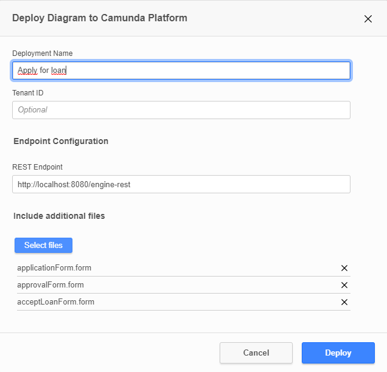

# Assignment11
assignment 11 system integration

### Preconditions
You need to have camunda on your PC, and know the basics of it.

### To run camunda files
1. Navigate to the ```./configuration/resources``` path of your Camunda folder.
2. Replace the contents of the Camunda-resources folder with the content of this projects BPMN folder ```resources/BPMN/*```.
3. Run Camunda
4. Open the Assignment11.bpmn with Camunda modeler and deploy it with the ```.form``` files attached.

It should look like this when you deploy: 



### To run the services
1. navigate to ```./resources/JavaScript``` in CLI
2. run command ```npm install```
3. run ```npm start```

You should see: 
```
[0] ✓ subscribed to topic Validation
[1] ✓ subscribed to topic ProductDetails
[2] ✓ subscribed to topic SendCopyOfDraft
[3] ✓ subscribed to topic Notification
```
---------------------------------------

Now you can test out some processes through the Camunda cockpit and tasklist. 

Go to ````localhost:8080````

Open the Camunda Cockpit and login with:
    
```
username: demo
password: demo
```

Now you can open the Camunda Tasklist by cliking on the "house" icon in the top right corner, hold ctrl and click on 
"Tasklist" to open it in a new tab in you browser.

### To run a process

1. Create a new process and update the windows with ```F5```.

2. Go in the task, and press ````claim```` above the form presented on the left. 

3. Now you can fill out the form and send a loan request. 

4. After sending, update the windows again. 

5. Now you see where the task is in the process in the cockpit tab. 

6. You can also see what has happend in the terminal running the nodejs scripts. 

7. You can now repeat the steps from step 1 until a task has reached the end node in the BPMN. 


**OBS** You will take the role as both loan applicant and Bank agent through the process. 
